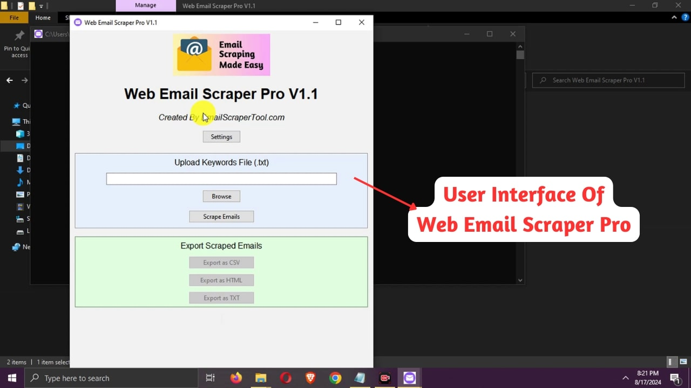

# Web Email Scraper Pro V1.1

Web Email Scraper Pro V1.1 is a powerful and user-friendly application designed to extract email addresses from websites based on specified keywords. This tool is ideal for businesses, marketers, and researchers who need to build targeted email lists efficiently.

## 🚀 Key Features

- Keyword-based web scraping
- Multi-threaded scraping for improved performance
- Proxy support with automatic rotation and failure handling
- Customizable email type filtering
- Time range selection for search results
- Export options: CSV, HTML, and TXT formats
- Pause and resume functionality
- Real-time progress tracking

## 📥 Download

**[Click here to download Web Email Scraper Pro V1.1](https://emailscrapertool.com/trail)**

## 📚 Documentation

- [Usage Instructions](docs/usage.md)
- [FAQ](docs/faq.md)
- [Support](docs/support.md)

## 🖼️ Screenshots

## 🔑 Licensing

Web Email Scraper Pro V1.1 requires a valid license key to operate. Visit our [official website](https://emailscrapertool.com/prices) to purchase a license.

## ⚠️ Disclaimer

This tool is designed for legitimate business purposes only. Users are responsible for complying with all applicable laws and regulations regarding email harvesting and usage.

## 🔗 Links

- [Official Website](https://emailscrapertool.com)
- [Buy Now](https://emailscrapertool.com/prices)
- [Support](https://emailscrapertool.com/contact)

## 📞 Contact

For any inquiries, please contact us at emailscrapertool@gmail.com

---

© 2023 EmailScraperTool.com. All rights reserved.
